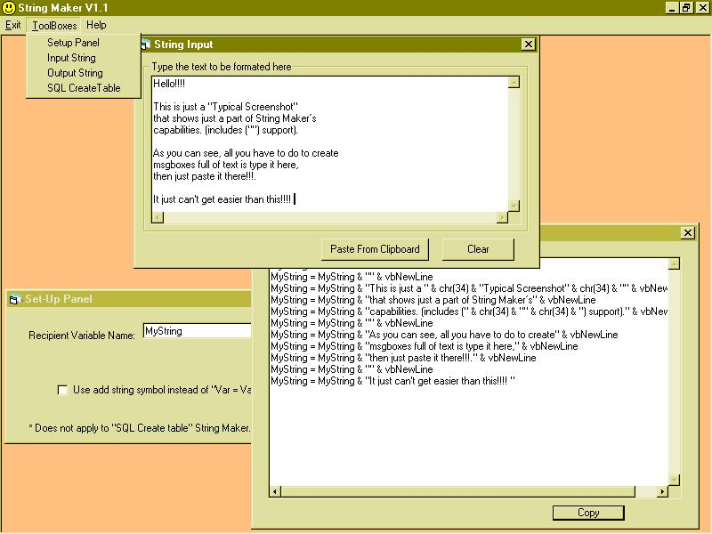



## String Maker V1\.1

### Description

Updated to v1.1, Fixed few bugs.

I always feel I loose a lot of time formating my msgbox strings.

String Maker is a program that formats your "normal text" into

a variable string usable in visual basic.

Lets say, for example, you want a msgbox to show this:

----

Warning:

The "input" parameters found

in the data size field can generate a

general protection error

----

String maker will format it for you to just copy and paste like this:

MyString = "

----

" & vbNewLine

MyString = MyString & " Warning:" & vbNewLine

MyString = MyString & "The " & chr(34) & "input" & chr(34) & "parameters" & vbNewLine

MyString = MyString & "found in the data size" & vbNewLine

MyString = MyString & "field can generate a" & vbNewLine MyString = MyString & "general protection error" & vbNewLine

MyString = MyString & "

----

"

Then you could use it like:

MsgBox mystring

It also has the capability to create SQL table strings:

MyString = "CREATE TABLE [tblThisTable] ("

MyString = MyString & "[fldBinary] Binary(20),"

MyString = MyString & "[fldBit] BIT,"

MyString = MyString & "[fildInteger] Short,"

MyString = MyString & "[fldText] Text(240)"

MyString = MyString & ")"

All you have to do is execute the string

like dbobject.execute mystring.

And, as always, it also shows the use of MDI projects, menus,

tray icon, popup menu in the tray icon, selections, etc...

You are allowed and encouraged to continue this project to grow

its capabilities... just keep me informed.

Thanx to the guy of the tray area control.

Note that you must use the exit menu command to close the program,

since pressing the X button in the window's controls will just send

the program to the tray area... Pretty much like audiogalaxy.

-Fongus
 
### More Info
 
The text to be formated

Formated text

Non known

             |
---                |---
**Submitted On**   |2001-08-09 13:54:34
**By**             |[AlGen Technologies](https://github.com/Planet-Source-Code/PSCIndex/blob/master/ByAuthor/algen-technologies.md)
**Level**          |Beginner
**User Rating**    |3.7 (11 globes from 3 users)
**Compatibility**  |VB 5\.0, VB 6\.0
**Category**       |[String Manipulation](https://github.com/Planet-Source-Code/PSCIndex/blob/master/ByCategory/string-manipulation__1-5.md)
**World**          |[Visual Basic](https://github.com/Planet-Source-Code/PSCIndex/blob/master/ByWorld/visual-basic.md)
**Archive File**   |[String Mak244058102001\.zip](https://github.com/Planet-Source-Code/algen-technologies-string-maker-v1-1__1-26063/archive/master.zip)

